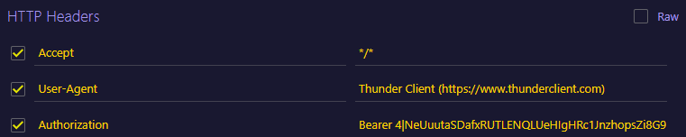

# Microservice Authentication – Concesionario de Vehículos

Este es un servicio de autenticación y gestión básica de identidades para un ecosistema modular (microservicios) de un aplicativo web de un concesionario de vehículos como parte del proyecto semestral de Ingeniería de Software II. Provee registro de usuarios, inicio/cierre de sesión mediante tokens personales (Laravel Sanctum), asignación automática de rol inicial, protección por middleware y soporte para pruebas unitarias. Está diseñado para operar de forma independiente y ser consumido por otros servicios pertenecientes del aplicativo bajo una arquitectura de microservicios propuesta.

---

## Tabla de Contenido

1. Propósito y Alcance  
2. Arquitectura y Flujo de Autenticación  
3. Roles Disponibles  
4. Endpoints API (detalle completo)  
5. Especificaciones de Seguridad  
6. Estructura de Carpetas Relevante  
7. Modelos y Relaciones  
8. Migraciones y Seeders  
9. Configuración y Puesta en Marcha (Local / Docker Proximamente)  
10. Variables de Entorno (.env) – Checklist  
11. Ejemplos de Uso en JSON  
12. Pruebas de Carga con Locust  
13. Middleware Personalizado (FilterIP)  
14. Buenas Prácticas y Recomendaciones Operativas  
15. Estrategia de Escalabilidad y Observabilidad (futuro)  
16. Roadmap Sugerido  
17. Troubleshooting

---

## 1. Propósito y Alcance

Este microservicio centraliza la autenticación de usuarios del concesionario bajo el framework de Laravel en versión 10. se encarga de gestionar:

- Registro de nuevos usuarios (rol asignado automaticamente: customer).
- Generación y revocación de tokens de acceso (usando Bearer) vía Laravel Sanctum.
- Inicio y cierre de sesión seguro (stateless para API).
- Control básico de acceso mediante roles (extensible y separación de responsabilidades).
- Puntos de prueba aislados para benchmarking de rendimiento usando Locust y un middleware de filtrado por dirección IP.

No incluye (aún): verificación de correo, recuperación de contraseña, refresco de tokens, ni autorización granular por permisos; se dejan en el roadmap para implementaciones futuras.

## 2. Arquitectura y Flujo de Autenticación

Resumen del flujo principal:

1. El cliente realiza una petición POST /api/register → se crea usuario con rol customer y se emite token personal (personal access token).
2. El cliente realiza una petición POST /api/login con credenciales → se valida y emite nuevo token.
3. Dicho cliente usa el token en encabezado `Authorization: Bearer <token>` para acceder a endpoints protegidos y mediar correctamente el uso del futuro frontend (ej. /api/logout u otros futuros).
4. Al cerrar sesión (petición POST /api/logout) se eliminan todos los tokens activos del usuario, sin embargo la información del usuario se mantiene en la base de datos (MariaDB), el token es temporal para efectos de seguridad y trazabilidad.

Características:

- Tokens emitidos con Sanctum: se almacenan en tabla `personal_access_tokens`.
- Diseño stateless para la API (no depende de sesión de servidor en endpoints de autenticación básica).
- Middleware `filter.ip` para filtrar la concurrencia de peticiones IP tanto del equipo en el que se desplegó como de equipos externos.

## 3. Roles Disponibles

Seed inicial (ver `RoleSeeder.php`):

| name     | label             | description                                      |
|----------|-------------------|--------------------------------------------------|
| admin    | Administrator     | Acceso completo al sistema                       |
| seller   | Seller            | Publica y gestiona vehículos                     |
| customer | Customer          | Explora vehículos y gestiona compras             |
| support  | Technical Support | Gestiona soporte y consultas                     |

Asignación inicial: todo usuario registrado vía petición /register recibe el rol `customer`. Cambios de rol se realizarán a través de un panel administrativo o endpoint futuro restringido a `admin`.

## 4. Endpoints API

Base: `/api`

| Método | Ruta             | Auth | Descripción | Middleware Extra |
|--------|------------------|------|-------------|------------------|
| POST   | /register        | No   | Registro de nuevo usuario y emisión de token | - |
| POST   | /login           | Sí   | Inicio de sesión y emisión de token          | - |
| POST   | /logout          | Sí   | Revocar tokens activos del usuario           | auth:sanctum |
| POST   | /test/register   | No   | Igual a /register solo para pruebas de carga | filter.ip |
| POST   | /test/login      | No   | Igual a /login para pruebas de carga         | filter.ip |

Respuestas estándar:

- 200/201: Éxito (JSON con token u objeto).
- 401: Credenciales inválidas.
- 403: Rechazo de IP (middleware).
- 422: Error de validación.

## 5. Especificaciones de Seguridad

- Framework: Laravel 10 + Sanctum.
- Hash de contraseñas: `bcrypt` (Hash::make) configurable en `config/hashing.php`.
- Token Bearer: enviada en `Authorization: Bearer <token>`.
- Revocación: `logout` elimina todos los tokens (`$request->user()->tokens()->delete()`).
- Protección de stress tests: `FilterIP` valida lista blanca (por defecto: 127.0.0.1, ::1). Extensible para CI/CD o IP internas.
- Anti-Enumeración: Mensajes genéricos en credenciales inválidas. (Posible mejora: retrasos progresivos o rate limiting granular por login.)
- Rate limiting: Perfil API incluye throttle (ver `Kernel.php` → grupo `api`). Ajustable en `RouteServiceProvider` / `config/ratelimit` (dinamico).
- CSRF: No aplica a endpoints API stateless (Sanctum maneja estado si se mezcla con front SPA; aquí se asume flujo token clásico).

## 6. Estructura de Carpetas Relevante

```text
app/Models/User.php
app/Models/Role.php
app/Http/Controllers/AuthController.php
app/Http/Middleware/FilterIP.php
routes/api.php
database/migrations/* (roles, users, tokens)
database/seeders/RoleSeeder.php
Locust_Test/locustfile.py
```

## 7. Modelos y Relaciones

`User` pertenece a un `Role` (FK `role_id`, nullable para flexibilidad).  
`Role` tiene muchos `User`.

## 8. Migraciones y Seeders

Migraciones claves:

- `create_roles_table`
- `add_role_id_to_users_table` (agrega FK a users)
- `create_personal_access_tokens_table` (por Sanctum – incluida por vendor/migraciones base)

Seeders:

- `RoleSeeder` → Inserta roles base.
- `DatabaseSeeder` (puede invocar RoleSeeder si se añade la llamada).

Comandos para el llenado automatico de la base de datos:

```bash
php artisan migrate --seed          # Ejecuta migraciones y seeders configurados
php artisan db:seed --class=RoleSeeder
```

## 9. Configuración y Puesta en Marcha

Requisitos:

- PHP >= 8.1
- Visual Studio Code para revisión.
- Composer
- Laragon con Servidor de base de datos MariaDB.
- Thunder Client para ejecutar las peticiones de tipo POST del microservicio.

Proximamente se integrara con docker y orquestación con kubernetes

```bash
git clone https://github.com/Therealdavi836/Microservice_Authentication.git
cd "/c/users/tu_usuario/desktop/Microservice_Authentication"
cp .env.example .env
# Actualizar dependencias de Laravel
composer update
php artisan key:generate
# Configurar variables DB en .env
php artisan migrate --seed
php artisan serve --host=0.0.0.0 --port=8000
```

La API quedará accesible en: `http://localhost:8000/api`/`http://127.0.0.1:8000/api`.
Probar este recurso en thunder client: `http://127.0.0.1:8000/api`

## 10. Variables de Entorno (.env) – Checklist

| Clave | Ejemplo | Notas |
|-------|---------|-------|
| APP_NAME | Laravel | Nombre lógico |
| APP_ENV | local | prod/staging/local |
| APP_KEY | (auto) | Generado con php artisan key:generate |
| APP_DEBUG | true | Desactivar en producción |
| APP_URL | <http://localhost> | Base para enlaces |
| LOG_CHANNEL | stack | Logging configurable |
| DB_CONNECTION | mysql | mysql |
| DB_HOST | 127.0.0.1 | |
| DB_PORT | 3306 | |
| DB_DATABASE | microservice_authentication | Se debe de crear primero la base de datos en Laragon->mysql|
| DB_USERNAME | root | |
| DB_PASSWORD |  | No hay contraseña por defecto |
| SANCTUM_STATEFUL_DOMAINS | (proximamente) localhost:5173 | Para SPA si aplica |
| SESSION_DOMAIN | localhost | (proximamente) (si se usa Sanctum modo SPA) |
| FRONTEND_URL | (proximamente) <http://localhost:5173> | Integración front |

Por favor ignorar las ultimas 3 columnas, el frontend se ira construyendo despues.

## 11. Ejemplos de Uso (JSON)

Para probar el funcionamiento del microservicio es necesario usar thunder client y enviar los datos a traves del body en petición POST

```JSON
//Probar registro
{
    "name":"Tu nombre",
    "email":"Tu correo electronico",
    "password": "Tu contraseña"
}
```

```JSON
//Probar inicio de sesión 
{
    "email":"Tu correo electronico",
    "password": "Tu contraseña"
}
```

Para probar el cierre de sesión se debe de enviar los datos en formato header de la siguiente forma ya que es necesario entregar el token y revocarlo


## 12. Pruebas de Carga con Locust

Se creó una carpeta con un locustfile para ejecutar pruebas de rendimiento

Archivo: `Locust_Test/locustfile.py`

Requisitos: Python 3.11+, pip gestor de paquetes de python y Locust instalado.

```bash
pip install locust
cd  "/c/users/tu_usuario/desktop/Microservice_Authentication/Locust_Test"
locust -f locustfile.py --host=http://127.0.0.1:8000
```

Abrir interfaz: <http://localhost:8089>  
Escenarios incluidos de prueba: registro masivo, login repetido, logout condicionado.  

## 14. Middleware Personalizado – FilterIP

Archivo: `app/Http/Middleware/FilterIP.php`

Función: Autoriza solo IPs en lista blanca para endpoints `/api/*`. Ideal para no exponer rutas de carga a internet pública.

Extensión sencilla: mover IPs a `.env` (ej: `LOAD_TEST_IPS=127.0.0.1,10.0.0.5`) y parsearlas.

## 15. Recomendaciones pensadas para implementar en un futuro

- Rotar tokens: permitir expiración configurable (extensión futura vía columnas `expires_at`).
- Registrar auditoría: Logins y revocaciones (Monolog / futura tabla audit_logs).
- Monitoreo: Integrar métricas (Prometheus + exporter Laravel) y alertar por picos anómalos.
- Evitar fuga de errores: Mantener mensajes de error genéricos en login.
- Protección extra: Agregar captcha tras N intentos fallidos.

## 16. Escalabilidad y Observabilidad (Diseño Futuro)

- Stateless horizontal scaling detrás de un balanceador.
- Cacheo de roles/permisos en Redis.
- Distribución de eventos (UserRegistered) vía cola para otros microservicios.
- Integración OpenTelemetry para trazas distribuidas.

## 17. Roadmap Sugerido

- [X] Verificación de correo y reenvío de token.
- [X] Recuperación / restablecimiento de contraseña.
- [X] Permisos granulares (tabla permissions + pivot role_permission).
- [X] Expiración y refresco de tokens.
- [X] Multi-factor (TOTP / Email OTP / SMS).
- [X] Webhooks para eventos de autenticación.

## 18. Troubleshooting y respuestas de peticiones del servidor

| Problema | Causa Común | Solución |
|----------|-------------|----------|
| 419 / CSRF token mismatch | Uso indebido de cookies en API pura | Usar Authorization Bearer |
| 401 credenciales inválidas | Email/contraseña erróneos | Verificar hash y migraciones ejecutadas |
| 403 en /api/* | IP no incluida | Añadir IP en middleware o ajusta lista blanca |
| 500 al registrar | Migraciones/seeders faltan | Ejecutar `php artisan migrate --seed` |
| Token no funciona | Header mal formado | Usar `Clave: Authorization: Valor:Bearer <token>` |

### Licencia

MIT (heredada de plantilla Laravel).

### Contacto / Mantenimiento

- Juan David Fajardo Betancourt
- Email: jfajardob@unal.edu.co

---
### Razón

- Proyecto semestral de Ingeniería de Software II, Semestre 2025-2.
- Presentado al docente: Jose Albeiro Montes Gíl.
- Documento de planeación:
- Informe de evidencia de ejecución de pruebas unitarias: 
